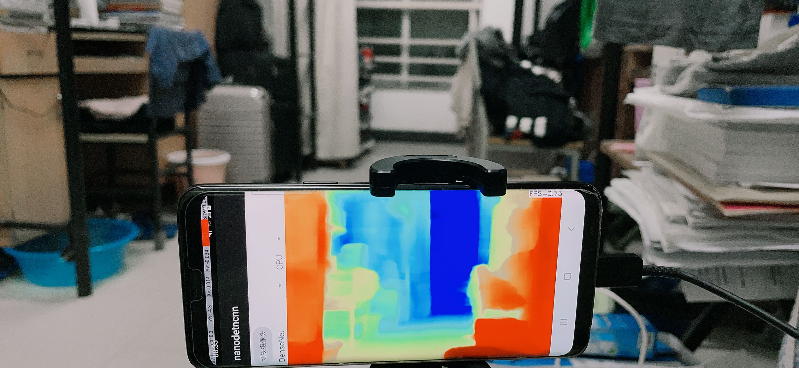

# monodepth-NCNN
将wavelet-monodepth的模型搬运到NCNN上，工程里面给了安卓的工程以及以及生成好的app安装包
### wavelet-monodepth
wavelet-monodepth：RGB图像的深度估计，wavelet顾名思义，就使用了小波变换的，官方的工程在这：https://github.com/nianticlabs/wavelet-monodepth
### 工程细节
1. 安卓上跑NCNN的工程参考的这个：https://github.com/nihui/ncnn-android-nanodet
2. 这里做的是NYUv2的模型，KITTI这个是车景的，我自己没车，就不做了
3. 官方一共有六个模型，DenseNet和MobilenetV2作为backbone的各三个，三个分别是baseline模型、wavelet模型、稀疏化的wavelet模型
4. baseline的两个模型都成功搬运了，效果不错
5. wavelet的两个模型也成功搬运了，但可能是小波部分直接转过来有点小问题，安卓上计算的结果比较一般(PS: 我测试发现这个ncnn模型在PC上跑出来的效果要更好一点)
6. 稀疏化的wavelet模型搬运失败，稀疏化部分个人心有余而力不足，做不来，放弃了
7. 最后工程一共有4个模型，MobilenetV2的baseline、MobilenetV2的wavelet、DenseNet的baseline、DenseNet的wavelet
### 工程编译
1. 正常来说在ncnn-android-nanodet/app/src/main/assets目录下应该能看到4个ncnn模型共8个文件，但模型比较大，上传github不方便，我传到了百度网盘，要编译的话，到网盘上下载这8个文件放到这个目录下就好了
### 安卓结果
我导出了APP给大家玩，就在apk目录下，但同样的由于模型大的问题，包含完整四个模型的安装包有500多M，完整的安装包我同样上传到了百度网盘，可以到网盘上下载来玩。

工程的apk目录下，我放了只包含了一个小模型的安装包，能运行默认的模型，可以看看效果，这个只有50多M，下的会快一点。

下图是app实际运行的效果图：

### 相关资源
1. [百度网盘](https://pan.baidu.com/s/1uzOXPqXM2RsTczJpcbwiKA)，提取码：6666
2. [知乎文章](https://zhuanlan.zhihu.com/p/419076068)
### 目前问题
1. 慢
2. wavelet小波部分转换疑似有问题，效果不好，而且安卓端和pc端的差异貌似也比较大
3. 稀疏化wavelet没做
